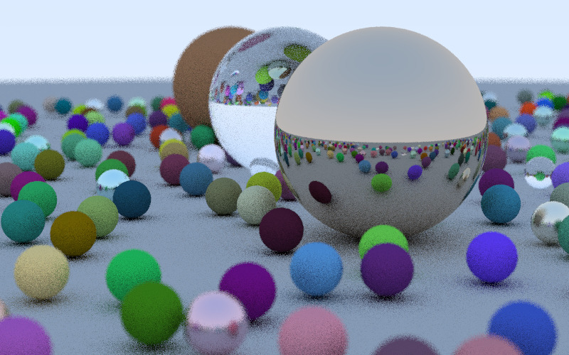

# Ray Tracer in Go

Working through Peter Shriley's [Ray Tracing in a Weekend](https://www.amazon.com/Ray-Tracing-Weekend-Minibooks-Book-ebook/dp/B01B5AODD8) book as an exercise to learn Go. Not likely very idiomatic Go as I'm following exercises written in C and this is the first thing I've done in Go. My main goal is use this as a base to play with goroutines/channels after completion.

Takeaways:
- I wrote tests for the vector class to get an understanding of writing tests in Go. Definitely miss Rspec and still don't think I agree with not having assertions in the standard test library but [Testify](https://github.com/stretchr/testify) seems nice.
- Not being able to override arithmetic operators make the code for this _really_ clunky at times.
- I don't like the decision to not support method overloading, as having to define something like `.MultiplyByVector(v Vector)` and `.MultiplyByFloat(t float64)` is painful, but this slides into not being able to override the arthimetic operators as well.
